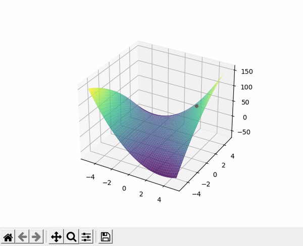

# zero_competition_gan
Optimizing min-max games using duality gap objective.  
This code is based upon (Generative Minimization Networks: Training GANs Without Competition; arXiv:2103.12685)

Function is .  
Optimizing using the duality gap objective.   

  
Optimizing using gradient ascent-descent.  

 
Objective is to learn the generator to generate samples from 3 guassians with std=1 and means= (-1,1,1)  
With the duality gap objective  

 
With the min-max objective. Original GAN:(Generative Adversarial Nets arXiv:1406.2661)  

